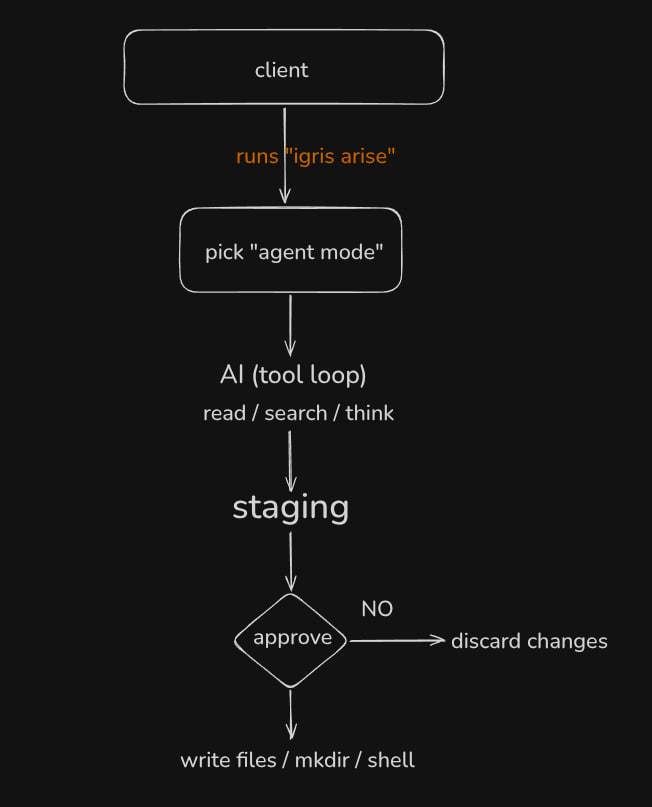

<pre>

██ ██████╗  ██████╗ ██╗███████╗
██║██╔════╝ ██╔══██╗██║██╔════╝
██║██║  ███╗██████╔╝██║███████╗
██║██║   ██║██╔══██╗██║╚════██║
██║╚██████╔╝██║  ██║██║███████║
╚═╝ ╚═════╝ ╚═╝  ╚═╝╚═╝╚══════╝ 

  </pre>

 

 
Personal coding agent , can be controlled via cli / telegram

  

 

## Work Flow

